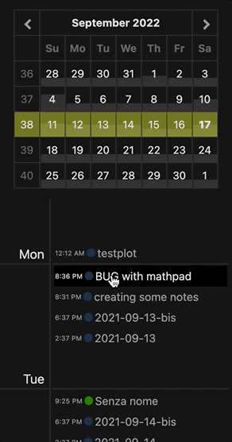

# Obsidian Chronology Plugin

Provides a sidebar with a calendar view of your notes.

The calendar allow to navingate and select a daily or weekly timeline. The notes will be shown in a vertical timeline.
The notes will be shown with a colored marked indicating if they were **created** or **modified** at that moment. 

Clicking on the name of the note will open it. Ctrl-(or Command-) clicking the note name will open it in a new pane.

In the calendar you can select the single days or the week number (on the left).

The days tiles background gives an indication about how many notes were created or edited that day. The scale depends also on the average number of daily notes set in the settings.

